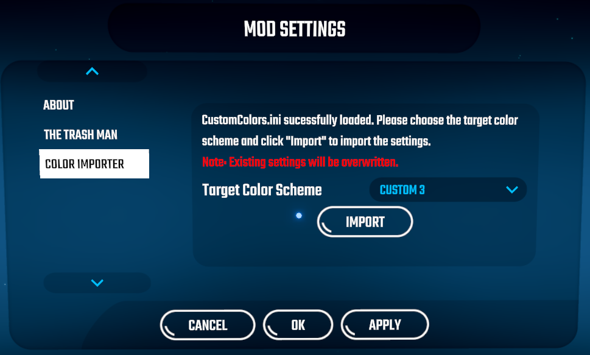

# Beat Saber ColorImporter

Migrates your old CustomColor mod settings to a Beat Saber user color scheme of your choice.

## Installation

Drop the DLL file into your plugins folder. 

## Usage

In the main menu, click on "Mod Settings", select "Color Importer", select the target color scheme of your choice and click on "Import".



## Removal

Delete the DLL file from your plugins folder.

## Contributing to ColorImporter
In order to build this project, please add a `ColorImporter.csproj.user` file in the project directory and specify where your game is located on your disk:

```xml
<?xml version="1.0" encoding="utf-8"?>
<Project xmlns="http://schemas.microsoft.com/developer/msbuild/2003">
  <PropertyGroup>
    <!-- Change this path if necessary. Make sure it ends with a backslash. -->
    <GameDirPath>C:\Program Files\Steam\steamapps\common\Beat Saber\</GameDirPath>
  </PropertyGroup>
</Project>
```
